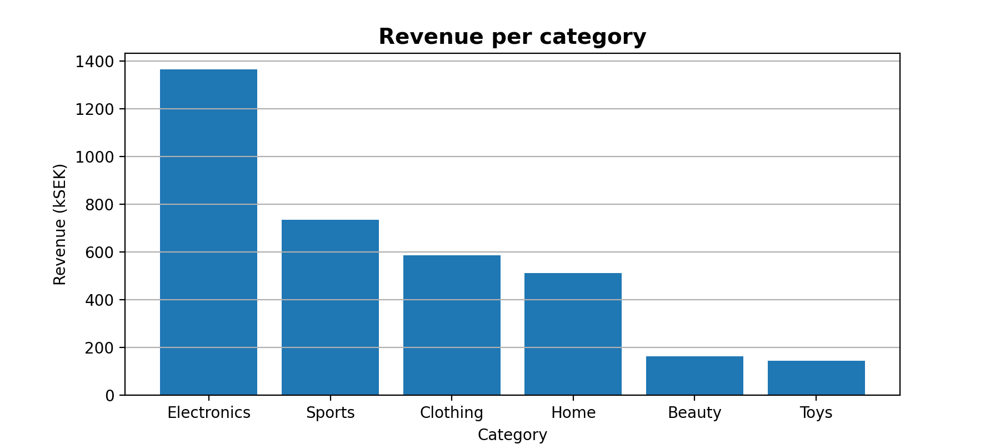
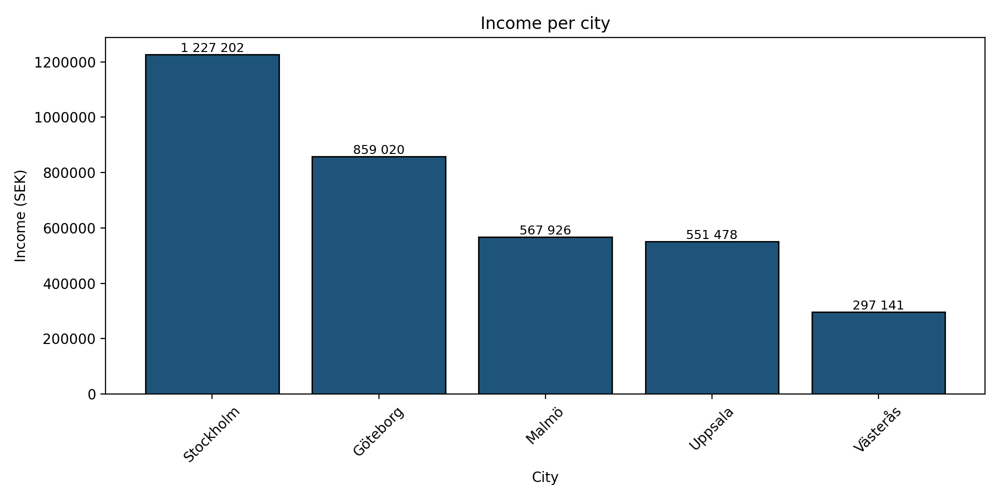

# Gruppuppgift_grupp3 e-handel snabbrapport

## Rapport
### Sammanfattning:
- **Total intäkt:** 3,5 miljoner kr
- **Averge order value:** 1,401 kr
- **Största kategorien:** Electronics, 1,4 miljoner kr
- **Stad med högst intäkt:** Stockholm, 1,2 miljoner kr

## Figurer




### Tabeller (exporterade)
- `data/ecommerce_sales.csv`

## Miljö
- **Python:** 3.11.9
- **Paket:** `Pandas`, `matplotlib`, `numpy` (se `requirements.txt`)

## Roller, Ansvar & Deltagare:
Ansvarsfördelningen inom gruppen har utvecklats på ett sätt där två medlemmar i huvudsak har tagit en drivande roll.  
Dessa personer har skött mycket av planering, strukturering och framdrift av arbetet, och har därigenom säkerställt kontinuitet i processen.  
Övriga gruppmedlemmar har deltagit mer begränsat. Närvaron har varierat och engagemanget har främst visat sig i samband med möten, vilket har inneburit att förarbete och uppgifter mellan träffarna inte alltid genomförts i samma utsträckning.  
Detta har lett till att arbetsbelastningen inte blivit helt jämnt fördelad inom gruppen.  
För komplett historik, se commits.

## Kom igång och installera

```bash
# klona projetet
git clone https://github.com/Jesdawow/Gruppuppgift_grupp3.git
cd gruppuppgift_grupp3

# Skapa och aktivera virtuell miljö
python -m venv .venv
# Windows PowerShell
.venv\Scripts\Activate
# macOS/Linux
# source .venv/bin/activate

# installera beroenden
python -m pip install -r requirements.txt
```
